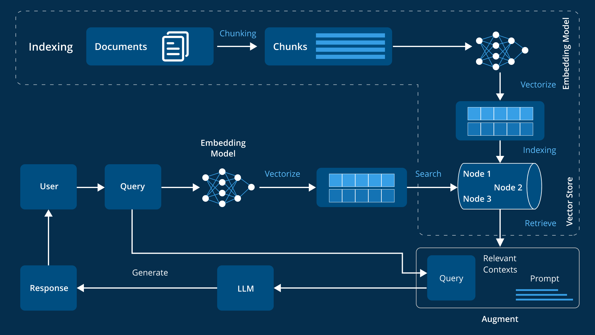
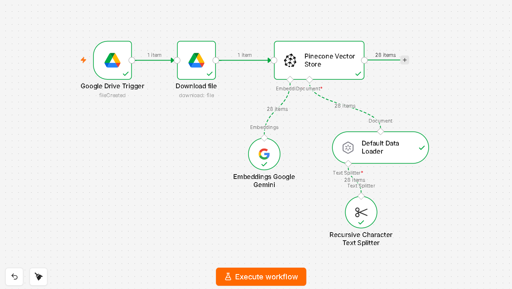
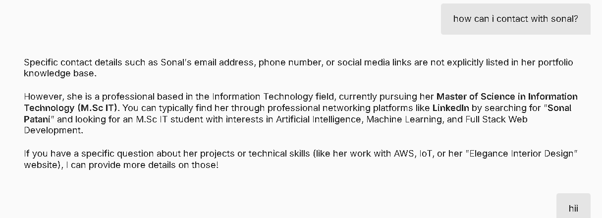

# 🤖 AI Portfolio Assistant using RAG

An AI-powered personal portfolio chatbot built using Retrieval-Augmented Generation (RAG).  
The chatbot answers questions about my education, skills, projects, achievements, and experience by retrieving information from my portfolio knowledge base.

---

## 🚀 Project Overview

Traditional chatbots depend only on pre-trained knowledge and cannot answer from personal documents.

This project solves that problem using RAG architecture. It retrieves relevant information from my portfolio documents stored in a vector database and generates accurate responses using an AI model.

The system processes documents, creates embeddings, stores them in Pinecone, and retrieves the most relevant context during conversations.

---

## ✨ Features

- 📄 Portfolio document-based question answering
- 🔍 Semantic search using vector embeddings
- 🧠 Context-aware AI responses
- 📚 Automated document processing pipeline
- ⚡ No-code AI workflow automation using n8n
- ☁️ Vector storage using Pinecone
- 🤖 Gemini-powered AI assistant

---

## 🛠️ Tech Stack

| Technology | Purpose |
|----------|---------|
| n8n | AI workflow automation |
| Google Gemini AI | Response generation |
| Gemini Embeddings | Text vector conversion |
| Pinecone | Vector database |
| Google Drive | Knowledge base storage |
| RAG | Retrieval-based AI architecture |

---

## 🏗️ System Architecture





Workflow:

```text
Portfolio Document
        ↓
n8n Data Loader
        ↓
Recursive Text Splitter
        ↓
Gemini Embeddings
        ↓
Pinecone Vector Store


User Question
        ↓
n8n AI Agent
        ↓
Retrieve Relevant Context
        ↓
Gemini AI Model
        ↓
Generated Answer
```

---

## ⚙️ Workflow Explanation

### 1. Document Ingestion Workflow

This workflow prepares the knowledge base.

Steps:

1. Portfolio document uploaded through Google Drive
2. n8n downloads the document
3. Data Loader extracts text
4. Text is divided into smaller chunks
5. Gemini creates vector embeddings
6. Embeddings are stored inside Pinecone


---

### 2. RAG Chatbot Workflow

This workflow handles user questions.

Steps:

1. User enters a question
2. AI Agent receives query
3. Relevant data is retrieved from Pinecone
4. Retrieved context is sent to Gemini AI
5. AI generates a portfolio-based answer


---

## 📸 Screenshots

### Document Processing Workflow




### Chatbot Output




---

## 📂 Repository Structure

```text
AI-Portfolio-Assistant-RAG/

├── architecture/
│   └── architecture.png
│
├── screenshots/
│   ├── workflow.png
│   └── chatbot.png
│
├── workflow/
│   ├── document_ingestion_workflow.json
│   └── rag_chatbot_workflow.json
│
├── knowledge_base/
│   └── portfolio_data.txt
│
└── README.md
```

---

## 🔮 Future Improvements

- Add web-based chatbot interface
- Deploy chatbot online
- Add voice assistant support
- Improve retrieval accuracy
- Add multiple document support

---

## 📌 Learning Outcome

Through this project, I learned:

- RAG architecture implementation
- Vector database concepts
- Embedding generation
- AI workflow automation
- LLM integration
- Building AI-powered assistants
